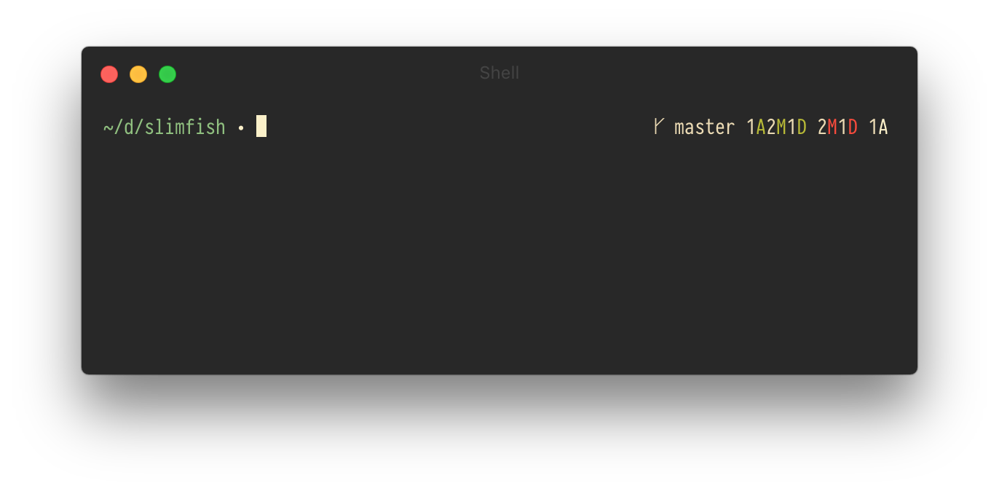
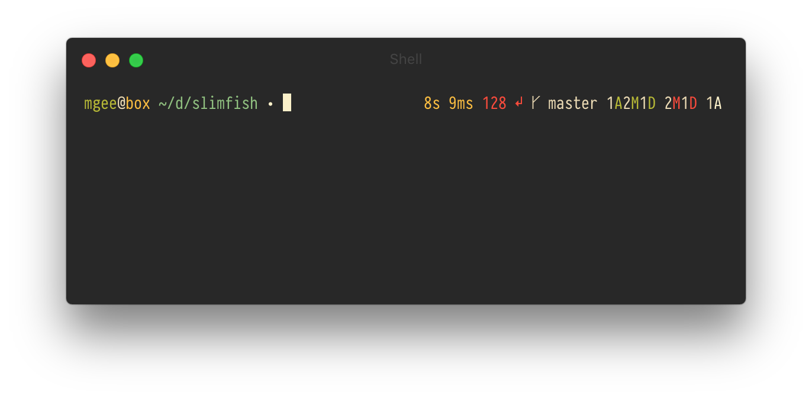
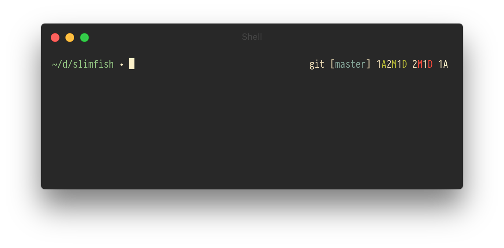

# slimfish

Minimal, customizable fast and elegant [fish](https://github.com/fish-shell/fish-shell) prompt. Displays the right information at the right time.

Features:
- sleek look
- customizable non-blocking git information display
- prompt symbol indicates if prompt background tasks are running
- exit code of last command if the exit code is not zero
- runtime of executed command if it exceeds a threshold
- username and host name if different than current user or connected to a ssh server
- very customizable



With all information (connected to ssh server, runtime and exit status from last command):



For a zsh compatible version of this theme have a look at [slimline](https://github.com/mgee/slimline).

## Table Of Contents

- [Requirements](#requirements)
    - [Optional](#optional)
- [Installation](#installation)
- [Options](#options)
    - [Prompt Symbol](#prompt-symbol)
    - [Current Working Directory](#current-working-directory)
    - [Exit Status](#exit-status)
    - [Execution Time](#execution-time)
    - [User and Host Info](#user-and-host-info)
    - [AWS Profile Info](#aws-profile-info)
    - [Auto Correction](#auto-correction)
    - [Git Information](#git-information)
        - [Gitline](#gitline)
    - [Async Mode](#async-mode)
- [Example](#example)
- [Thanks](#thanks)
- [License](#license)

## Requirements

* fish

### Optional

* python 2.6+ to enable git information display

## Installation

With [fisherman](https://github.com/fisherman/fisherman)

```fish
fisher mgee/slimfish
cd $HOME/.config/fisherman/slimfish
git submodule update --init
```

## Options

Slimfish can be customized using a variety of environment variables.
For an example on how to do so see the [example](#example).

### Prompt Symbol

##### `SLIMFISH_PROMPT_SYMBOL`

Defines the symbol of the prompt. Default is `∙`.

##### `SLIMFISH_PROMPT_SYMBOL_COLOR_WORKING`

Defines the color of the prompt when asynchronous tasks are running. Default is `red`.

##### `SLIMFISH_PROMPT_SYMBOL_COLOR_READY`

Defines the color of the prompt when all asynchronous tasks are finished. Default is `white`.

### Current Working Directory

##### `SLIMFISH_CWD_COLOR`

Defines the color of the current working directory. Default is `cyan`.

##### `SLIMFISH_CWD_ROOT_COLOR`

Defines the color of the current working directory if it equals the root directory `/`. Default is `red`.

### Exit Status

##### `SLIMFISH_DISPLAY_EXIT_STATUS`

Defines whether the exit status is displayed if the exit code is not zero. Default is `1`.

##### `SLIMFISH_EXIT_STATUS_SYMBOL`

Defines the symbol of the exit status glyph. Default is `↵`.

##### `SLIMFISH_EXIT_STATUS_COLOR`

Defines the color of the exit status information. Default is `red`.

### Execution Time

##### `SLIMFISH_DISPLAY_EXEC_TIME`

Defines whether the runtime of a process is displayed if it exceeds the maximum execution time
specified by the option below. Default is `1`.

##### `SLIMFISH_MAX_EXEC_TIME`

Defines the maximum execution time of a process until its run time is displayed on exit.
Default is `5` seconds.

##### `SLIMFISH_EXEC_TIME_COLOR`

Defines the color of the execution time. Default is `yellow`.

### User and Host Info

##### `SLIMFISH_DISPLAY_USER_HOST_INFO`

Defines whether the `user@host` part is displayed if the user differs from the default user of if connected to a ssh server. Default is `1`.

##### `SLIMFISH_USER_COLOR`

Defines the color of the user. Default is `green`.

##### `SLIMFISH_USER_ROOT_COLOR`

Defines the color of the user if the user is root. Default is `red`.

##### `SLIMFISH_HOST_COLOR`

Defines the color of the host. Default is `yellow`.

### AWS Profile Info

##### `SLIMFISH_DISPLAY_AWS_INFO`

Defines whether value of `AWS_PROFILE` environment variable should be displayed. Default is `0`.

##### `SLIMFISH_AWS_COLOR`

Defines the color of aws profile info. Default is `blue`.

### Async Mode

#### `SLIMFISH_ENABLE_ASYNC`

Defines whether the prompt data should be obtained asynchronously (if possible).
This currently only includes the gitline data. Default is `1`.

### Git Information

##### `SLIMFISH_ENABLE_GIT`

Defines whether git information shall be displayed (requires python). Default is `1`.

#### Gitline

slimfish uses [gitline](https://github.com/mgee/gitline) to display git information.
gitline can be extensively customized. Have a look at the [gitline options](https://github.com/mgee/gitline#options).

## Example

Here is an example for customizing the prompt symbol as well as the git repository indicator and
branch format:

```shell
set -x SLIMFISH_PROMPT_SYMBOL '$'
# If you have a powerline compatible font you can also use the alternative repo indicator ''.
set -x GITLINE_REPO_INDICATOR '${reset}git'
set -x GITLINE_BRANCH '[${blue}${branch}${reset}]'
```



## Thanks

- [sindresorhus/pure](https://github.com/sindresorhus/pure)
- [sorin-ionescu/prezto](https://github.com/sorin-ionescu/prezto.git)

## License

Released under the [MIT License](LICENSE)
